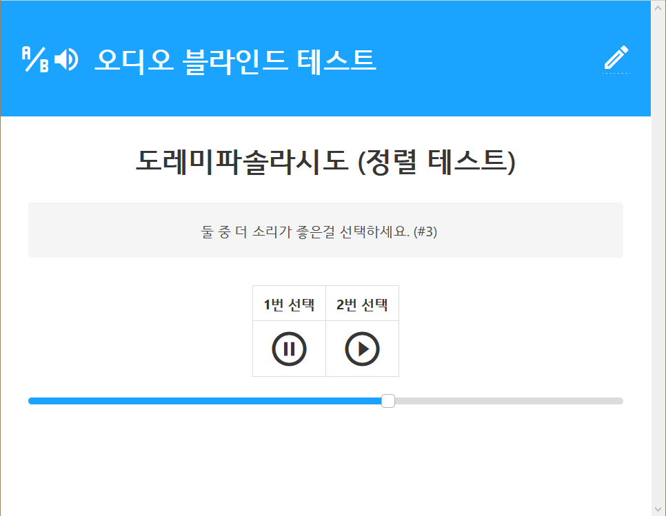
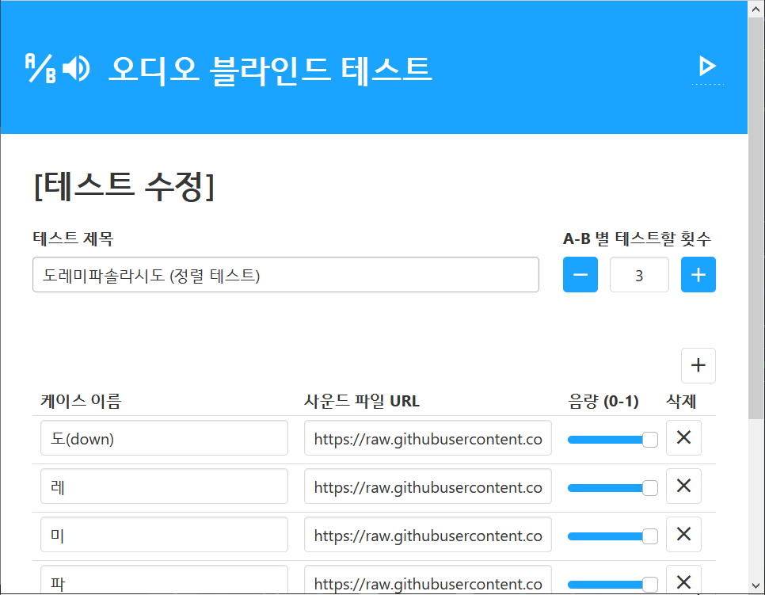

# audio-az-test

[프로그램 실행](https://apps.trgksoft.com/audioAZtest/)

간단하게 오디오 블라인드 테스트를 할 수 있는 어플리케이션입니다.

블라인드 테스트를 제작/수정할수도 있습니다.

## 예시 테스트
- [도레미파솔라시도](https://apps.trgksoft.com/audioAZtest/#wqtWw4pJTErDjVHCslJ6w53Dn8OyekHDh8Orw7U7w57DtsO0wrxpwpvDsnrDrsKeN8Odc8KAwoIKGm8WTH3CvWDCjcOCw5vDlsKeN11Lw552w63DkFTDklFKw40rKcOKTC1WwrLCisKuRjZBIyXCvzwPJF9aBBLDiSgpKSjCtsOSw5cvSizDl0vDjyzDiShNKi1OLUrDjsOPKwHDqsOXS8OOw4_DlS_DiCg1NTE2MsOUTyxNw4nDjHfCjCpJLS7DkcOPTSwuSS3DkgfCsVMSSxLDtVPDssKLUnMzw5MQDF0DQ8K9wrTCnMOEZMKgRWXDuTnCpcK5wqlKVsKGwrU6SC5Zw5BBBzcYw6F3w4PDuh10cMKDMV43AMKjwpIObjDDgcOrBmBawqLCgxtMw7HDh8OFw5w9dHDCgxnDvnDDqMKeQwc3wpjDow8HYA4tLcKgR8O-wrTDgHRHbC0A)
  : 간단하게 블라인드 테스트가 어떤 것인지 체험해볼 수 있습니다. 더 높은 음을 고르시면 됩니다. (ex: 파 < **라**)
- [HDxxx, HDV820, Apple 꼬다리 DAC](https://apps.trgksoft.com/audioAZtest/#wrXCk8K_DsKCMBDCh1_ChXTDkgRpw4E_MUwSGXwCB8KNQ8KlwqfDhVQkwrQQEsOCwrvDm0LDgsKgMXbDqXbCucK2w7fDu8OywqXDlyFBwq8gUMKMDsOpwoYQwq_CkcKeLjZEwo7DlcKWTFVEwqTDryVlKcOAS8KTw73DmDzDqi7DshEUwqrDikHCosO4w5x9wozCm00Pw6bDul5dwpkTwq5UKWPCjDNWBA_DiUDDpE0VFMKgw7DCncOjwpLDl8Orw5UyCjHCrVnDvkpOCsKkw5o9wqlUUGFTM8KqKMOmwqxtWzwELMKowpnCr8OHBzdBMx3DkcK8RMO9BBTCh8K9w7_DhTLDsjoCw6HCrMORw4PDv2EYwrFuwp3DqARrKQPCjTsrBsOFSsOLw7DDi8KcajEJwrZaRhpnWgYUOy3CkcOjBcOSAcOWUiLClwtkQH4pwrnDtG8)
